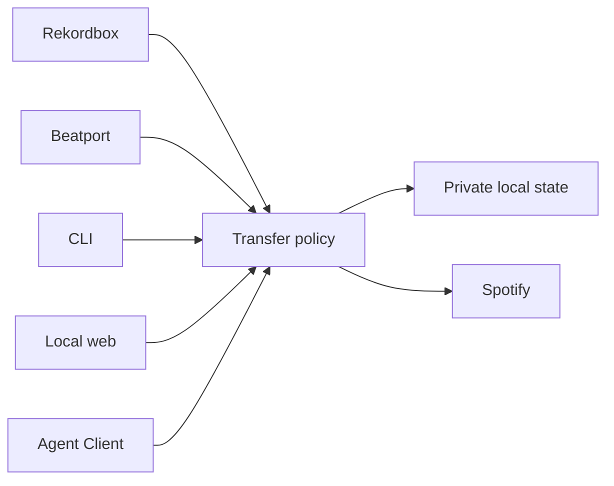

The public `Transfer` interface owns high-level policy. CLI, local web, and Agent Clients are thin renderings over the same contract; they may not create separate matching, Approval, persistence, or publication rules.

Read the canonical [architecture document](https://github.com/spontain112/djsupport/blob/main/docs/architecture.md) for module boundaries, adapters, effects, and recovery states.
