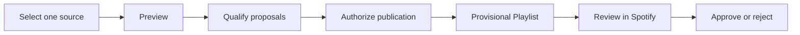

A **Transfer** is one complete attempt to move an explicitly selected source into Spotify. It includes matching, publication, retained knowledge, and an outcome report.

<CardGroup cols={2}>
  <Card title="Mirror" icon="refresh-cw">An ongoing relationship. Later Transfers can update the Spotify playlist to match its Rekordbox source.</Card>
  <Card title="Snapshot" icon="camera">A one-time Spotify playlist representing a Beatport chart or label selection at the time of Transfer.</Card>
</CardGroup>

## The lifecycle

<Warning>
  A Provisional Playlist is not an approval. Removing a proposed track before approval rejects that proposed match.
</Warning>
